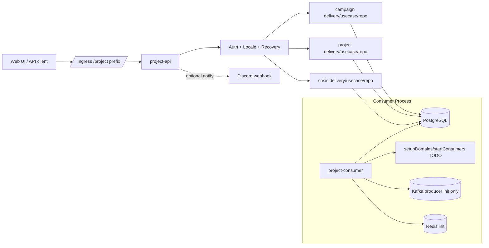
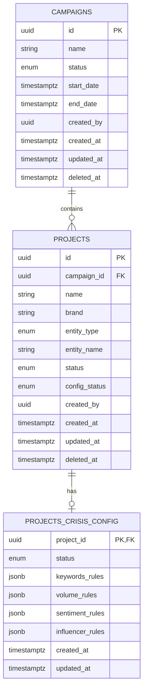
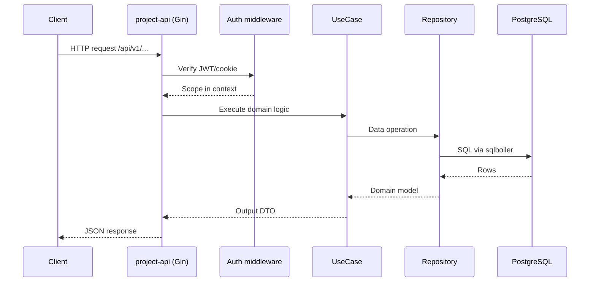
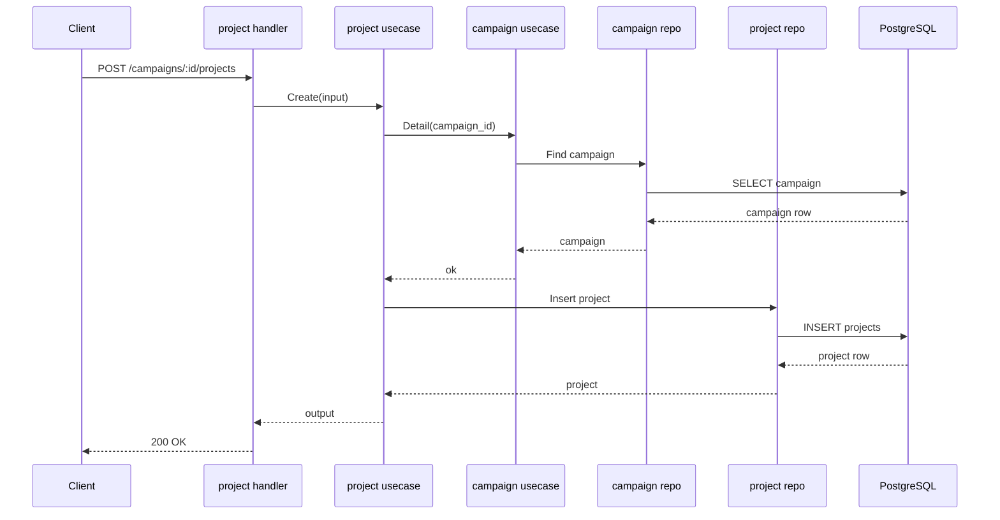
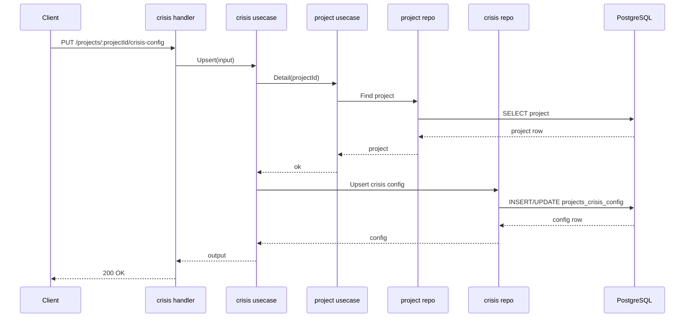
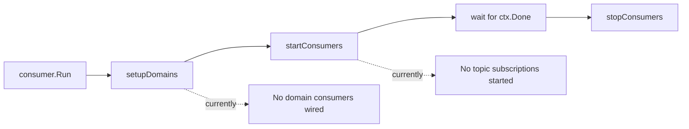

# SMAP Project Service

Project domain service for SMAP.

Scan timestamp: 2026-03-13

## 1. Current Scope

This repository currently provides:

- Campaign management (CRUD + archive)
- Project management under campaign (CRUD + archive)
- Crisis configuration per project (upsert/detail/delete)
- API health/readiness/liveness endpoints
- HTTP auth middleware (Bearer token or auth cookie)

Out of scope for this repository (owned by `dispatcher-srv` / `ingest-srv`):

- Data source management (`/datasources`, target CRUD, crawl-mode updates)
- Dryrun execution and dryrun result lifecycle
- Runtime dispatch/scheduler/queue orchestration
- Raw batch ingestion and UAP publish pipeline

This repository does not yet provide (project-domain scope):

- Project activation flow/state machine
- Domain Kafka event publishing (`project.created`, `project.activated`, etc.)
- Real Kafka consumer logic (consumer service is scaffold only)

Boundary summary with `dispatcher-srv`:

| Domain area | Owner |
| --- | --- |
| Campaign / Project / Crisis Config | `project-srv` |
| Data Source / Target / Dryrun / Dispatch runtime | `dispatcher-srv` (`ingest-srv` module) |

## 2. Runtime Components

- `cmd/api/main.go`: HTTP API process
- `cmd/consumer/main.go`: consumer process bootstrap (currently no domain consumer attached)
- PostgreSQL: primary storage
- Redis: initialized and injected, not used by current domain logic
- Kafka: producer initialized in consumer process, but no active consume/publish domain flow

## 3. Architecture

Code follows delivery -> usecase -> repository layering per module:

- `internal/campaign/*`
- `internal/project/*`
- `internal/crisis/*`
- `internal/httpserver/*`
- `internal/consumer/*`

Cross-module dependency flow:

- `project` usecase depends on `campaign` usecase to validate `campaign_id`
- `crisis` usecase depends on `project` usecase to validate `project_id`



## 4. API Base Path

Internal service routes:

- Base: `/api/v1`

Ingress route (see `manifests/ingress.yaml`) strips `/project` prefix:

- External gateway path: `/project/api/v1/...`

System endpoints (no auth):

- `GET /health`
- `GET /ready`
- `GET /live`
- `GET /swagger/*any`

## 5. Auth Model

All business endpoints are protected by `mw.Auth()`.

Token resolution order:

1. `Authorization` header (`Bearer <token>` or raw token)
2. Cookie (`cookie.name`, default `smap_auth_token`)

Token is verified using shared JWT secret (`jwt.secret_key`) and scope payload is injected into request context.

## 6. Domain API Contract (Implemented)

### 6.1 Campaign

Prefix: `/api/v1/campaigns`

| Method | Path | Description |
| --- | --- | --- |
| POST | `/campaigns` | Create campaign |
| GET | `/campaigns` | List campaigns (pagination + filters) |
| GET | `/campaigns/:id` | Campaign detail |
| PUT | `/campaigns/:id` | Update campaign |
| DELETE | `/campaigns/:id` | Archive campaign (soft delete by `deleted_at`) |

Supported statuses:

- `ACTIVE`
- `INACTIVE`
- `ARCHIVED`

### 6.2 Project

Prefix:

- Nested create/list: `/api/v1/campaigns/:id/projects`
- Direct project routes: `/api/v1/projects/:projectId`

| Method | Path | Description |
| --- | --- | --- |
| POST | `/campaigns/:id/projects` | Create project under campaign |
| GET | `/campaigns/:id/projects` | List projects under campaign |
| GET | `/projects/:projectId` | Project detail |
| PUT | `/projects/:projectId` | Update project |
| DELETE | `/projects/:projectId` | Archive project (soft delete by `deleted_at`) |

Supported `entity_type`:

- `product`
- `campaign`
- `service`
- `competitor`
- `topic`

Supported `status`:

- `ACTIVE`
- `PAUSED`
- `ARCHIVED`

Supported `config_status` (stored on project):

- `DRAFT`
- `CONFIGURING`
- `ONBOARDING`
- `ONBOARDING_DONE`
- `DRYRUN_RUNNING`
- `DRYRUN_SUCCESS`
- `DRYRUN_FAILED`
- `ACTIVE`
- `ERROR`

### 6.3 Crisis Config

Prefix: `/api/v1/projects/:projectId/crisis-config`

| Method | Path | Description |
| --- | --- | --- |
| PUT | `/projects/:projectId/crisis-config` | Create/update crisis config |
| GET | `/projects/:projectId/crisis-config` | Get crisis config |
| DELETE | `/projects/:projectId/crisis-config` | Delete crisis config |

Stored trigger blocks:

- `keywords_trigger`
- `volume_trigger`
- `sentiment_trigger`
- `influencer_trigger`

Crisis status enum:

- `NORMAL`
- `WARNING`
- `CRITICAL`

## 7. Data Model

Main tables:

- `schema_project.campaigns`
- `schema_project.projects` (`campaign_id` FK -> campaigns)
- `schema_project.projects_crisis_config` (`project_id` PK/FK -> projects)



## 8. Dataflow

### 8.1 API Request Flow



### 8.2 Project Creation with Campaign Validation



### 8.3 Crisis Upsert with Project Validation



### 8.4 Consumer Flow (Current State)



## 9. Configuration

Config loading order:

1. `./config/project-config.yaml`
2. `./project-config.yaml`
3. `/etc/smap/project-config.yaml`
4. Environment variables (override file values)

Use example file:

- `config/project-config.example.yaml`

Minimum required keys for API startup:

- `jwt.secret_key` (>= 32 chars)
- `encrypter.key` (>= 32 chars)
- `postgres.host`, `postgres.port`, `postgres.user`, `postgres.dbname`
- `redis.host`, `redis.port`
- `cookie.name`
- `internal.internal_key`

## 10. Local Development

### 10.1 Start dependencies

```bash
make dev-up
```

### 10.2 Prepare config

```bash
cp config/project-config.example.yaml config/project-config.yaml
```

Update secrets in `config/project-config.yaml`.

### 10.3 Migrate database

```bash
make migrate-up
```

Note:

- `make migrate-up` currently applies only `migration/init_schema.sql`.
- If you need crisis config table migration separately, verify and apply `migration/000002_add_crisis_config.sql` manually with correct schema.

### 10.4 Run API

```bash
go run cmd/api/main.go
```

Swagger UI:

- `http://localhost:8080/swagger/index.html`

### 10.5 Run consumer

```bash
go run cmd/consumer/main.go
```

## 11. Implementation Status Summary

Implemented now:

- Campaign API module
- Project API module
- Crisis config API module
- Auth middleware and health checks
- PostgreSQL repositories via sqlboiler

Not implemented yet:

- Wizard/activation orchestration
- Domain Kafka event contracts
- Real consumer subscriptions and handlers
- Automated tests (`*_test.go` not present)

## 12. Known Limitations

- Archive operations set `deleted_at`, but list/detail queries do not currently enforce `deleted_at IS NULL`.
- Consumer service validates infra dependencies, but runtime domain consumers are TODO.
- Some legacy docs under `documents/` describe planned features beyond current implementation.
