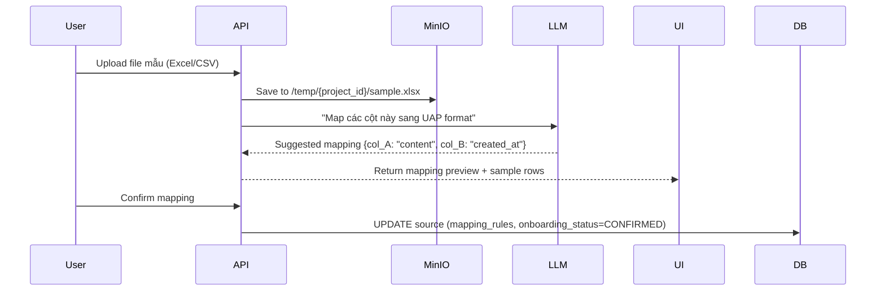
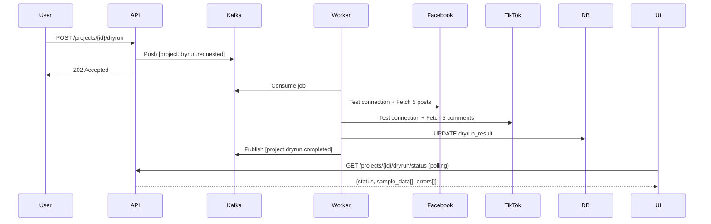

# Project Service - Gap Analysis

> Legacy planning note (not source of truth for ownership).
> As of 2026-03-13, Data Source/Target/Dryrun/Dispatch runtime ownership is in `dispatcher-srv` (`ingest-srv`), not `project-srv`.
> Use `project-srv/README.md` and `dispatcher-srv/README.md` as canonical boundary references.

**Ngày tạo:** 18/02/2026  
**Phiên bản:** v1.0  
**Reference Documents:**

- [dataflow-detailed-v2.md](file:///f:/SMAP_v2/dataflow-detailed-v2.md)
- [migration-plan-v2.md](file:///f:/SMAP_v2/migration-plan-v2.md)
- [bsrrule.md](file:///f:/SMAP_v2/bsrrule.md)

---

## Tổng quan

Document này liệt kê chi tiết những gì còn thiếu trong `project-srv` so với thiết kế tham chiếu từ **SMAP Migration Plan v2** và **Data Flow Specification v2.1**.

---

## 1. ENTITY HIERARCHY & DATABASE SCHEMA

### ✅ Đã Implement

| Feature                               | Status  | File Reference                                                                      |
| ------------------------------------- | ------- | ----------------------------------------------------------------------------------- |
| Campaign entity                       | ✅ Done | [campaigns table](file:///f:/SMAP_v2/project-srv/migration/init_schema.sql#L59-L74) |
| Project entity                        | ✅ Done | [projects table](file:///f:/SMAP_v2/project-srv/migration/init_schema.sql#L84-L103) |
| Campaign ↔ Project relationship (1-N) | ✅ Done | Foreign key `campaign_id`                                                           |
| `brand` field (text metadata)         | ✅ Done | Line 91                                                                             |
| `entity_type` enum                    | ✅ Done | Lines 47-54, 92                                                                     |
| `entity_name` field                   | ✅ Done | Line 93                                                                             |
| `config_status` enum                  | ✅ Done | Lines 34-45, 97                                                                     |
| Status enum for Campaign              | ✅ Done | `ACTIVE`, `INACTIVE`, `ARCHIVED`                                                    |
| Status enum for Project               | ✅ Done | `ACTIVE`, `PAUSED`, `ARCHIVED`                                                      |

### ❌ Thiếu Hoàn Toàn

#### 1.1 Data Source Entity

**Requirement:** Tầng 1 của Entity Hierarchy - Physical Data Unit

> [!CAUTION]
> **CRITICAL MISSING:** Toàn bộ logic Data Source management chưa có trong project-srv.

**Cần implement:**

```sql
-- ingest.data_sources table (nên tạo ở ingest-srv, nhưng project-srv cần reference)
CREATE TABLE ingest.data_sources (
    id UUID PRIMARY KEY,
    project_id UUID NOT NULL REFERENCES schema_project.projects(id),
    type VARCHAR(50) NOT NULL, -- FILE_UPLOAD, WEBHOOK, FACEBOOK, TIKTOK, YOUTUBE
    name VARCHAR(255),
    config JSONB NOT NULL, -- Source-specific config
    status VARCHAR(20) DEFAULT 'PENDING', -- PENDING, ACTIVE, ERROR, DISABLED

    -- Onboarding (cho FILE_UPLOAD & WEBHOOK)
    mapping_rules JSONB, -- AI Schema Mapping result
    onboarding_status VARCHAR(20), -- PENDING, MAPPING_READY, CONFIRMED

    -- Dry Run (cho Crawl sources)
    last_check_at TIMESTAMPTZ,
    last_error_msg TEXT,

    -- Metadata
    created_by UUID NOT NULL,
    created_at TIMESTAMPTZ DEFAULT NOW(),
    updated_at TIMESTAMPTZ DEFAULT NOW()
);

-- Dry Run Results (chỉ cho Crawl sources)
CREATE TABLE ingest.dryrun_results (
    id UUID PRIMARY KEY,
    project_id UUID NOT NULL,
    status VARCHAR(20) NOT NULL, -- SUCCESS, PARTIAL, FAILED
    result_data JSONB NOT NULL, -- Sample data + errors per source
    created_at TIMESTAMPTZ DEFAULT NOW(),
    expires_at TIMESTAMPTZ -- Auto cleanup sau 24h
);
```

**API Endpoints cần thêm:**

```
POST   /projects/{id}/sources               # Tạo Data Source
GET    /projects/{id}/sources                # List Sources của Project
GET    /projects/{id}/sources/{sourceId}    # Chi tiết 1 Source
PUT    /projects/{id}/sources/{sourceId}    # Update Source config
DELETE /projects/{id}/sources/{sourceId}    # Delete Source

# Data Onboarding (AI Schema Mapping)
POST   /sources/{id}/schema/preview          # AI suggest mapping
POST   /sources/{id}/schema/confirm          # User confirm mapping
POST   /sources/{id}/upload-sample           # Upload file mẫu (FILE_UPLOAD)

# Dry Run (Crawl Sources)
POST   /projects/{id}/dryrun                 # Trigger Dry Run
GET    /projects/{id}/dryrun/status          # Poll Dry Run result
```

#### 1.2 Campaign-Projects Junction (Optional)

**Current:** 1 Project thuộc 1 Campaign (1-N via FK)

**Requirement (từ spec):** 1 Campaign có thể group nhiều Projects để RAG scope

> [!NOTE]
> Hiện tại FK `campaign_id` đã đủ cho requirement. Junction table chỉ cần nếu muốn **1 Project thuộc nhiều Campaigns** (N-N).

**Decision:** SKIP (defer to future if needed)

---

## 2. PROJECT CREATION WIZARD FLOW

### ✅ Đã Implement

| Feature              | Status  |
| -------------------- | ------- |
| Basic Project CRUD   | ✅ Done |
| Campaign CRUD        | ✅ Done |
| Crisis Config Upsert | ✅ Done |

### ❌ Thiếu Hoàn Toàn

#### 2.1 Multi-Step Wizard (6 bước)

**Requirement:** [Flow 0 - dataflow-detailed-v2.md](file:///f:/SMAP_v2/dataflow-detailed-v2.md#L90-L566)

> [!WARNING]
> **HIGH PRIORITY:** Wizard flow là core UX cho project creation. Thiếu flow này thì user không thể config Data Source.

**6 Steps phải implement:**

1. **Tạo Project** (✅ Partial - thiếu `brand`, `entity_type`, `entity_name` validation)
2. **Chọn & Config Data Source** (❌ Thiếu hoàn toàn)
3. **Analytics Config** (❌ Thiếu - hiện tại không có endpoint config analytics)
4. **Data Onboarding** (❌ Thiếu - AI Schema Mapping cho FILE_UPLOAD/WEBHOOK)
5. **Dry Run** (❌ Thiếu - Test Crawl sources)
6. **Activate Project** (❌ Thiếu - Complex activation logic)

#### 2.2 Activate Project Logic

**Requirement:** [Section 3.6](file:///f:/SMAP_v2/dataflow-detailed-v2.md#L404-L456)

```go
// POST /projects/{id}/activate
func (h *handler) ActivateProject(c *gin.Context) {
    // 1. Validate điều kiện Activate
    //    - Nếu có Crawl sources → Dry Run phải SUCCESS/WARNING
    //    - Nếu có Passive sources → Onboarding phải CONFIRMED

    // 2. Update project status = ACTIVE

    // 3. Update config_status = ACTIVE

    // 4. Activate từng Data Source
    //    - Crawl sources: Create scheduled jobs
    //    - WEBHOOK: Generate production webhook_url + secret

    // 5. Publish Kafka event: [project.activated]

    // 6. Return: {project_id, webhook_urls[], schedules[]}
}
```

#### 2.3 State Machine Validation

**Requirement:** [Section 3.7](file:///f:/SMAP_v2/dataflow-detailed-v2.md#L458-L509)

**Thiếu logic:**

- Frontend nút "Activate" disable cho đến khi đủ điều kiện
- Backend enforce state transitions (DRAFT → CONFIGURING → ... → ACTIVE)
- Webhook trong Project chỉ có Webhook URL khi status = ACTIVE

---

## 3. DATA SOURCE MANAGEMENT

### ❌ Thiếu Hoàn Toàn Module `ingest`

**Requirement:** Data Source là tầng 1 của Entity Hierarchy

> [!CAUTION]
> **BLOCKER:** Không có Data Source thì không thể ingest data vào hệ thống. Đây là dependency quan trọng nhất.

**Các loại Data Source cần support:**

| Type          | Onboarding Mechanism | Trigger        | Reference                                                       |
| ------------- | -------------------- | -------------- | --------------------------------------------------------------- |
| `FILE_UPLOAD` | AI Schema Mapping    | Manual upload  | [Flow 1](file:///f:/SMAP_v2/dataflow-detailed-v2.md#L569-L641)  |
| `WEBHOOK`     | AI Schema Mapping    | External push  | [Flow 2](file:///f:/SMAP_v2/dataflow-detailed-v2.md#L643-L721)  |
| `FACEBOOK`    | Dry Run              | Scheduled poll | [Flow 2b](file:///f:/SMAP_v2/dataflow-detailed-v2.md#L724-L757) |
| `TIKTOK`      | Dry Run              | One-time crawl | ditto                                                           |
| `YOUTUBE`     | Dry Run              | Scheduled poll | ditto                                                           |

**Modules cần tạo:**

```
internal/
  project/
    ... (existing)
  data_source/        # NEW MODULE
    domain.go         # Source types, states
    usecase/
      create.go       # Create source
      list.go         # List sources by project_id
      update.go       # Update config
      delete.go       # Delete source
      onboarding.go   # AI Schema Mapping flow
      dryrun.go       # Dry Run flow
    delivery/http/
      handlers.go
      presenters.go
      routes.go
    repository/postgre/
      source.go
```

---

## 4. AI SCHEMA AGENT (DATA ONBOARDING)

### ❌ Thiếu Hoàn Toàn Logic LLM Integration

**Requirement:** [Section 0.3 - migration-plan-v2.md](file:///f:/SMAP_v2/migration-plan-v2.md#L123-L158)

**Flow:**



**Cần implement:**

1. **LLM Client** (OpenAI/Gemini SDK)
2. **Prompt Engineering** cho schema mapping
3. **Preview endpoint** (`POST /sources/{id}/schema/preview`)
4. **Confirm endpoint** (`POST /sources/{id}/schema/confirm`)

---

## 5. DRY RUN MECHANISM

### ❌ Thiếu Hoàn Toàn Async Dry Run

**Requirement:** [Section 3.5](file:///f:/SMAP_v2/dataflow-detailed-v2.md#L322-L403)

> [!WARNING]
> Dry Run là async job (qua Kafka), không phải synchronous API call.

**Flow:**



**Cần implement:**

1. **Kafka Producer** trong project-srv (publish `project.dryrun.requested`)
2. **DryRun Result** storage (table `ingest.dryrun_results`)
3. **Polling endpoint** (`GET /projects/{id}/dryrun/status`)

**⚠️ Dependency:** Cần ingest-worker implement consumer logic.

---

## 6. KAFKA EVENT PUBLISHING

### ❌ Thiếu Hoàn Toàn Kafka Integration

**Requirement:** [Event-driven architecture](file:///f:/SMAP_v2/dataflow-detailed-v2.md)

**Events cần publish:**

| Event                      | Trigger                      | Consumer                     | Purpose                                |
| -------------------------- | ---------------------------- | ---------------------------- | -------------------------------------- |
| `project.created`          | POST /projects               | analytics-srv, knowledge-srv | Initialize project context             |
| `project.activated`        | POST /projects/{id}/activate | ingest-worker                | Start scheduled crawl jobs             |
| `project.crisis.started`   | Crisis detected              | ingest-worker                | Tăng tần suất crawl (Reactive Scaling) |
| `project.dryrun.requested` | POST /projects/{id}/dryrun   | ingest-worker                | Trigger dry run                        |
| `project.archived`         | DELETE /projects/{id}        | All services                 | Cleanup resources                      |

**Cần implement:**

```go
// pkg/kafka/producer.go
type EventPublisher interface {
    PublishProjectCreated(ctx context.Context, projectID string) error
    PublishProjectActivated(ctx context.Context, projectID string, sources []Source) error
    PublishCrisisStarted(ctx context.Context, projectID string, severity string) error
    PublishDryRunRequested(ctx context.Context, projectID string, sources []Source) error
}
```

---

## 7. ANALYTICS CONFIG

### ❌ Thiếu Endpoint Config Analytics

**Requirement:** [Section 3.3](file:///f:/SMAP_v2/dataflow-detailed-v2.md#L191-L213)

**Default config:**

- Sentiment: ON
- Aspect: ON
- Keywords: ON

**Cần implement:**

```
PUT /projects/{id}/analytics-config
{
  "sentiment_enabled": true,
  "aspect_enabled": true,
  "keywords_enabled": true,
  "custom_aspects": ["Giá", "Chất lượng", "Dịch vụ"],
  "alert_threshold": {
    "negative_percent": 15
  }
}
```

**Storage:**

```sql
-- Option 1: JSONB trong projects table
ALTER TABLE schema_project.projects
ADD COLUMN analytics_config JSONB DEFAULT '{"sentiment_enabled": true, "aspect_enabled": true, "keywords_enabled": true}';

-- Option 2: Separate table (nếu config phức tạp)
CREATE TABLE schema_project.analytics_configs (
    project_id UUID PRIMARY KEY REFERENCES schema_project.projects(id),
    sentiment_enabled BOOLEAN DEFAULT true,
    aspect_enabled BOOLEAN DEFAULT true,
    keywords_enabled BOOLEAN DEFAULT true,
    custom_aspects TEXT[],
    alert_threshold JSONB,
    updated_at TIMESTAMPTZ DEFAULT NOW()
);
```

---

## 8. DASHBOARD & AGGREGATION ENDPOINTS

### ❌ Thiếu Dashboard API

**Requirement:** [Section 1.2 - migration-plan-v2.md](file:///f:/SMAP_v2/migration-plan-v2.md#L318-L337)

**UC-02: Brand Monitoring** - Dashboard cho 1 Project

**Cần implement:**

```
GET /projects/{id}/dashboard
{
  "overview": {
    "total_mentions": 1250,
    "sentiment_distribution": {"positive": 45, "neutral": 30, "negative": 25},
    "top_aspects": [{"name": "Giá", "sentiment": "negative", "count": 150}]
  },
  "time_series": [
    {"date": "2026-02-17", "mentions": 120, "negative_percent": 28}
  ],
  "top_keywords": ["pin", "giá", "sụt nhanh"],
  "crisis_status": "NORMAL" // NORMAL | WARNING | CRITICAL
}
```

**⚠️ Dependency:** Cần call analytics-srv để lấy insights.

---

## 9. SERVICE INTEGRATIONS

### ❌ Thiếu Hoàn Toàn HTTP Clients

**Requirement:** Project-srv cần gọi các service khác

| Target Service  | Purpose                       | Example Call                           |
| --------------- | ----------------------------- | -------------------------------------- |
| `ingest-srv`    | Trigger crawl, onboarding     | `POST /internal/trigger-crawl`         |
| `analytics-srv` | Lấy insights cho dashboard    | `GET /internal/projects/{id}/insights` |
| `knowledge-srv` | Create RAG scope khi activate | `POST /internal/campaigns/{id}/scope`  |
| `noti-srv`      | Push crisis alert             | `POST /internal/alerts`                |

**Cần implement:**

```go
// internal/client/
type IngestClient interface {
    TriggerDryRun(ctx context.Context, projectID string, sources []Source) (*DryRunJob, error)
    ConfirmMapping(ctx context.Context, sourceID string, mapping MappingRules) error
}

type AnalyticsClient interface {
    GetProjectInsights(ctx context.Context, projectID string, from, to time.Time) (*Insights, error)
}

type KnowledgeClient interface {
    CreateCampaignScope(ctx context.Context, campaignID string, projectIDs []string) error
}
```

---

## 10. VALIDATION & BUSINESS RULES

### ✅ Đã Implement

- Crisis Config validation (4 trigger types)
- Request-level validation (presenters.go)
- Enum validation (status, entity_type)

### 🟡 Cần Enhance

#### 10.1 Keyword Logic Validation

**Requirement:** [bsrrule.md](file:///f:/SMAP_v2/bsrrule.md#L8-L11)

```go
// internal/crisis/delivery/http/presenters.go
func (r upsertReq) validate() error {
    if r.KeywordsTrigger.Enabled {
        // Validate keyword groups structure
        for _, group := range r.KeywordsTrigger.Groups {
            if group.Name == "" {
                return errInvalidKeywordGroup
            }
            if len(group.Keywords) == 0 {
                return errors.New("keyword group must have at least 1 keyword")
            }
            // NEW: Validate logic type
            if group.Logic != "MAIN" && group.Logic != "SECONDARY" && group.Logic != "EXCLUSION" {
                return errors.New("keyword logic must be MAIN, SECONDARY, or EXCLUSION")
            }
        }
    }
    // ... (similar for other triggers)
}
```

#### 10.2 Project Lifecycle State Transitions

**Requirement:** [Section 3.7](file:///f:/SMAP_v2/dataflow-detailed-v2.md#L465-L498)

```go
// internal/project/usecase/project.go
func (uc *implUseCase) Activate(ctx context.Context, projectID string) error {
    project, _ := uc.repo.Detail(ctx, projectID)

    // Validate state transition
    if project.ConfigStatus != "DRYRUN_SUCCESS" && project.ConfigStatus != "ONBOARDING_DONE" {
        return errors.New("project not ready to activate")
    }

    // Validate có ít nhất 1 Data Source
    sources, _ := uc.sourceRepo.GetByProjectID(ctx, projectID)
    if len(sources) == 0 {
        return errors.New("project must have at least 1 data source")
    }

    // Check Dry Run results cho Crawl sources
    crawlSources := filterCrawlSources(sources)
    if len(crawlSources) > 0 {
        dryRunResult, _ := uc.dryRunRepo.GetLatest(ctx, projectID)
        if dryRunResult.Status == "FAILED" {
            return errors.New("dry run failed, cannot activate")
        }
    }

    // Check Onboarding cho Passive sources
    passiveSources := filterPassiveSources(sources)
    for _, src := range passiveSources {
        if src.OnboardingStatus != "CONFIRMED" {
            return errors.New("onboarding not confirmed, cannot activate")
        }
    }

    // All good → Activate
    // ... (update DB, publish Kafka event)
}
```

---

## 11. TESTING

### ✅ Đã Có

- `scripts/test_crisis_only.py` - Test Crisis Config validation (38/38 passed)

### ❌ Thiếu

1. **Integration Tests** cho Wizard flow
2. **E2E Tests** cho Activate Project
3. **Kafka Event Tests** (mock consumers)
4. **Dry Run Tests** (mock external APIs)

---

## 12. PRIORITIZED ROADMAP

### Phase 1: Core Data Source (2-3 tuần)

> [!IMPORTANT]
> **BLOCKER:** Không có Data Source thì không thể test end-to-end flow.

- [ ] Create `internal/data_source` module
- [ ] Implement CRUD endpoints
- [ ] Add DB migration cho `ingest.data_sources`
- [ ] Integration với MinIO (file upload)

### Phase 2: AI Schema Agent (1 tuần)

- [ ] LLM client (OpenAI SDK)
- [ ] Mapping preview/confirm endpoints
- [ ] Unit tests cho prompt engineering

### Phase 3: Dry Run (1 tuần)

- [ ] Kafka producer setup
- [ ] DryRun request endpoint
- [ ] Polling status endpoint
- [ ] Mock ingest-worker consumer (test only)

### Phase 4: Activate Project (1 tuần)

- [ ] State machine validation
- [ ] Activate endpoint với complex logic
- [ ] Webhook URL generation (cho WEBHOOK sources)
- [ ] Publish `project.activated` event

### Phase 5: Dashboard (1 tuần)

- [ ] Analytics client implementation
- [ ] Aggregation endpoints
- [ ] Time-series queries

### Phase 6: Polish (1 tuần)

- [ ] Comprehensive tests
- [ ] Documentation
- [ ] Error handling refinement

---

## Summary

### 📊 Gap Statistics

| Category        | Implemented | Missing | Coverage |
| --------------- | ----------- | ------- | -------- |
| Database Schema | 8/10        | 2       | 80%      |
| API Endpoints   | 15/35       | 20      | 43%      |
| Modules         | 3/6         | 3       | 50%      |
| Integrations    | 0/5         | 5       | 0%       |
| **TOTAL**       | **26/56**   | **30**  | **46%**  |

### 🎯 Top 3 Priorities

1. **Data Source Management** (Module mới, 20 endpoints)
2. **Kafka Integration** (Event publishing, 5 events)
3. **Activate Project Logic** (Complex state machine, 1 endpoint nhưng critical)

---

**Next Steps:** Đọc [service_interactions.md](file:///f:/SMAP_v2/project-srv/documents/service_interactions.md) để hiểu chi tiết cách project-srv tương tác với các service khác.
