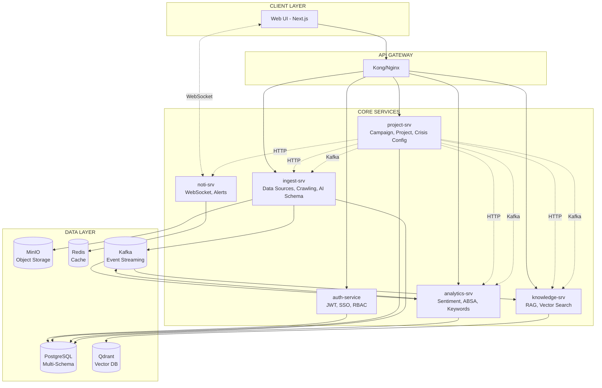
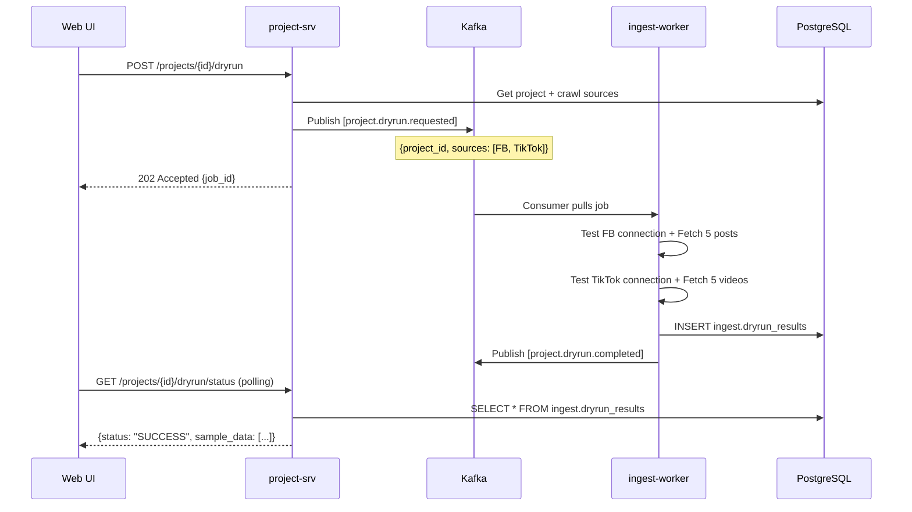
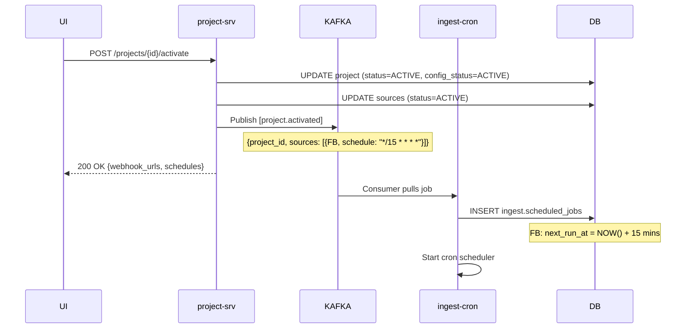
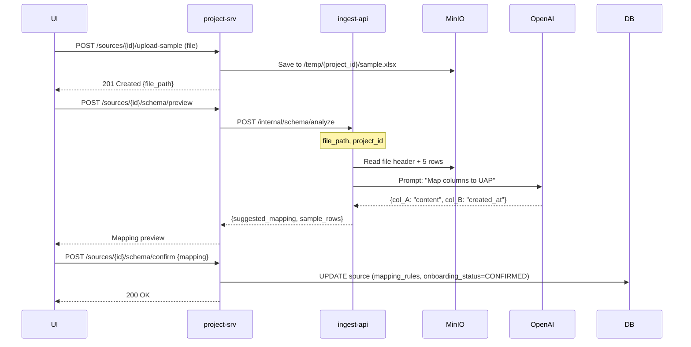
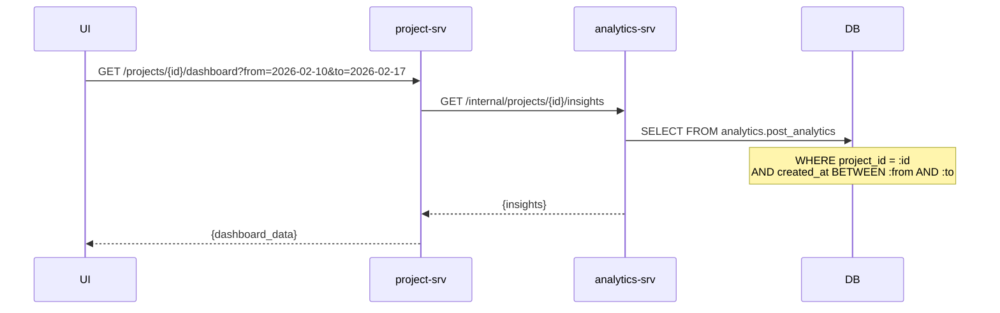
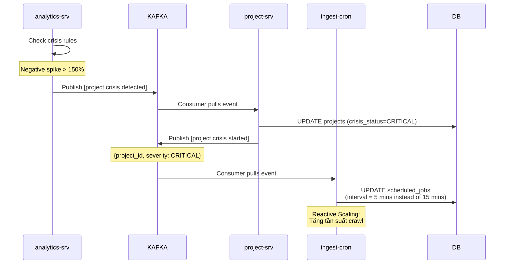
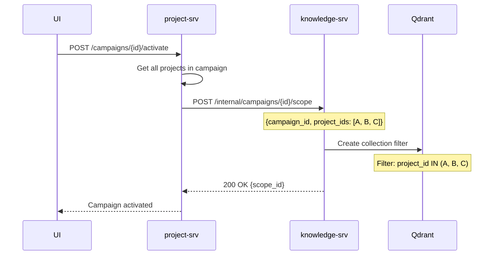
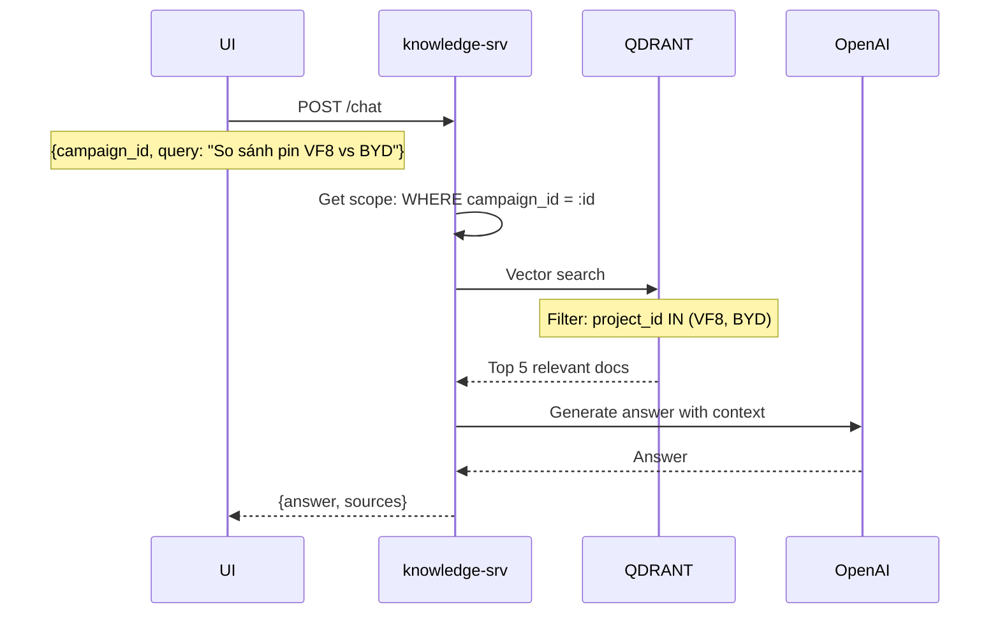
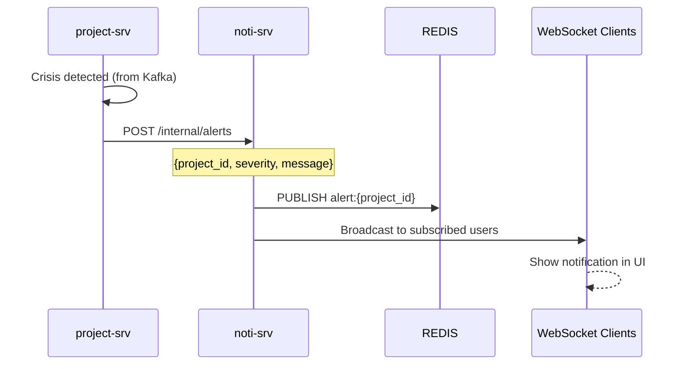

# Project Service - Service Interactions

> Legacy planning note (not source of truth for ownership).
> As of 2026-03-13, Data Source/Target/Dryrun/Dispatch runtime ownership is in `dispatcher-srv` (`ingest-srv`), not `project-srv`.
> Use `project-srv/README.md` and `dispatcher-srv/README.md` as canonical boundary references.

**Ngày tạo:** 18/02/2026  
**Phiên bản:** v1.0  
**Mục đích:** Mô tả chi tiết cách `project-srv` tương tác với các microservices khác trong hệ thống SMAP Enterprise.

---

## Tổng quan Kiến trúc



---

## 1. PROJECT-SRV ↔ AUTH-SERVICE

### 1.1 JWT Validation (Middleware)

**Direction:** project-srv → auth-srv (Optional fallback)

**Pattern:** Shared Secret Validation (HS256)

```go
// internal/middleware/auth.go
type AuthMiddleware struct {
    jwtSecret   string
    authClient  *AuthClient // Fallback for /internal/validate
}

func (m *AuthMiddleware) Authenticate(r *http.Request) (*User, error) {
    // 1. Extract JWT from Authorization header
    token := r.Header.Get("Authorization")
    if token == "" {
        return nil, ErrUnauthorized
    }

    // 2. Try local validation first (HS256 with shared secret)
    claims, err := jwt.Parse(token, m.jwtSecret)
    if err == nil {
        return &User{
            ID:    claims.UserID,
            Email: claims.Email,
            Role:  claims.Role,
        }, nil
    }

    // 3. Fallback: Call auth-srv internal API
    return m.authClient.ValidateToken(ctx, token)
}
```

**Auth-srv Internal API:**

```
POST /internal/validate
Authorization: Bearer <jwt_token>

Response:
{
  "user": {
    "id": "uuid",
    "email": "user@vinfast.com",
    "role": "ANALYST"
  },
  "valid": true
}
```

### 1.2 User Lookup (for Audit Log)

**Direction:** project-srv → auth-srv

**Use Case:** Khi cần thông tin user chi tiết (name, department) cho audit log

```go
GET /internal/users/{user_id}

Response:
{
  "id": "uuid",
  "email": "analyst@vinfast.com",
  "name": "Nguyễn Văn A",
  "department": "Marketing",
  "role": "ANALYST"
}
```

### 1.3 Audit Events (Event-Driven)

**Direction:** project-srv → auth-srv (via Kafka)

**Pattern:** Async event publishing, auth-srv consumer writes to audit log

```go
// project-srv publishes audit events
kafka.Publish("auth.audit", AuditEvent{
    UserID:    user.ID,
    Action:    "PROJECT_CREATED",
    Resource:  "project:" + projectID,
    IP:        c.ClientIP(),
    Timestamp: time.Now(),
    Metadata:  {"project_name": "Monitor VF8"},
})
```

**Auth-srv Consumer:**

```go
// auth-srv/cmd/consumer/main.go
func ConsumeAuditEvents() {
    for msg := range kafka.Subscribe("auth.audit") {
        event := ParseAuditEvent(msg)
        db.Insert("auth.audit_logs", event)
    }
}
```

---

## 2. PROJECT-SRV ↔ INGEST-SRV

### 2.1 Trigger Dry Run (HTTP + Kafka)

**Flow:** User click "Dry Run" → project-srv → ingest-srv



**API Contract:**

```yaml
# project-srv API
POST /projects/{project_id}/dryrun
Request: {} # Empty body
Response: 202 Accepted
{
  "job_id": "uuid",
  "status": "RUNNING"
}

GET /projects/{project_id}/dryrun/status
Response: 200 OK
{
  "status": "SUCCESS | PARTIAL | FAILED",
  "sources": [
    {
      "source_id": "src_facebook_01",
      "type": "FACEBOOK",
      "status": "OK",
      "sample_count": 5,
      "sample_data": [
        {"content": "...", "created_at": "2026-02-17T10:00:00Z"}
      ]
    },
    {
      "source_id": "src_tiktok_01",
      "type": "TIKTOK",
      "status": "ERROR",
      "error": "Invalid API key"
    }
  ],
  "completed_at": "2026-02-17T10:05:32Z"
}
```

**Kafka Event Schema:**

```json
// Topic: project.dryrun.requested
{
  "event_id": "uuid",
  "project_id": "proj_vinfast_vf8",
  "sources": [
    {
      "source_id": "src_facebook_01",
      "type": "FACEBOOK",
      "config": {"page_id": "vinfast", "access_token": "xxx"}
    }
  ],
  "requested_by": "user_id",
  "requested_at": "2026-02-17T10:00:00Z"
}

// Topic: project.dryrun.completed
{
  "event_id": "uuid",
  "project_id": "proj_vinfast_vf8",
  "status": "SUCCESS",
  "result_id": "dryrun_result_uuid",
  "completed_at": "2026-02-17T10:05:32Z"
}
```

### 2.2 Activate Project → Start Crawl Jobs

**Flow:** User click "Activate" → project-srv → ingest-srv



**Kafka Event:**

```json
// Topic: project.activated
{
  "event_id": "uuid",
  "project_id": "proj_vinfast_vf8",
  "sources": [
    {
      "source_id": "src_facebook_01",
      "type": "FACEBOOK",
      "config": { "page_id": "vinfast", "access_token": "xxx" },
      "schedule": "*/15 * * * *", // Every 15 mins
      "status": "ACTIVE"
    },
    {
      "source_id": "src_webhook_01",
      "type": "WEBHOOK",
      "webhook_url": "https://smap.local/webhook/abc123",
      "secret": "xxx",
      "status": "ACTIVE"
    }
  ],
  "activated_by": "user_id",
  "activated_at": "2026-02-17T10:10:00Z"
}
```

### 2.3 AI Schema Agent (Onboarding)

**Flow:** User upload file → project-srv → ingest-srv (sync LLM call)



**ingest-srv Internal API:**

```yaml
POST /internal/schema/analyze
Request:
{
  "file_path": "/temp/proj_abc/sample.xlsx",
  "source_type": "FILE_UPLOAD"
}

Response: 200 OK
{
  "suggested_mapping": {
    "Ý kiến khách hàng": "content",
    "Ngày gửi": "content_created_at",
    "Tên KH": "metadata.author"
  },
  "sample_rows": [
    {
      "content": "Xe đi êm",
      "content_created_at": "2026-02-15T08:00:00Z",
      "metadata": {"author": "Nguyễn A"}
    }
  ],
  "confidence": 0.95
}
```

---

## 3. PROJECT-SRV ↔ ANALYTICS-SRV

### 3.1 Dashboard Insights (HTTP)

**Flow:** User view dashboard → project-srv → analytics-srv



**analytics-srv Internal API:**

```yaml
GET /internal/projects/{project_id}/insights?from=2026-02-10&to=2026-02-17
Response: 200 OK
{
  "summary": {
    "total_mentions": 1250,
    "sentiment_distribution": {
      "positive": 45,
      "neutral": 30,
      "negative": 25
    },
    "top_aspects": [
      {"aspect": "Giá", "sentiment": "negative", "count": 150}
    ]
  },
  "time_series": [
    {
      "date": "2026-02-17",
      "mentions": 120,
      "positive": 50,
      "neutral": 35,
      "negative": 35
    }
  ],
  "top_keywords": ["pin", "giá", "sụt nhanh"]
}
```

### 3.2 Crisis Detection → Reactive Scaling

**Flow:** analytics-srv detect crisis → Kafka → project-srv → ingest-srv



**Kafka Event:**

```json
// Topic: project.crisis.detected (analytics-srv → project-srv)
{
  "event_id": "uuid",
  "project_id": "proj_vinfast_vf8",
  "severity": "CRITICAL | WARNING",
  "trigger_type": "VOLUME | SENTIMENT | KEYWORDS | INFLUENCER",
  "details": {
    "current_negative_percent": 35,
    "baseline_negative_percent": 15,
    "threshold": 25
  },
  "detected_at": "2026-02-17T10:15:00Z"
}

// Topic: project.crisis.started (project-srv → ingest-srv)
{
  "event_id": "uuid",
  "project_id": "proj_vinfast_vf8",
  "severity": "CRITICAL",
  "action": "INCREASE_CRAWL_FREQUENCY",
  "started_at": "2026-02-17T10:15:05Z"
}
```

---

## 4. PROJECT-SRV ↔ KNOWLEDGE-SRV

### 4.1 Create Campaign Scope (RAG Context)

**Flow:** User activate campaign → project-srv → knowledge-srv



**knowledge-srv Internal API:**

```yaml
POST /internal/campaigns/{campaign_id}/scope
Request:
{
  "project_ids": ["proj_vf8", "proj_byd_seal"],
  "name": "So sánh Xe điện"
}

Response: 200 OK
{
  "scope_id": "scope_uuid",
  "project_count": 2,
  "status": "ACTIVE"
}
```

### 4.2 RAG Query with Campaign Scope

**Flow:** User chat với RAG → knowledge-srv (không qua project-srv)



---

## 5. PROJECT-SRV ↔ NOTI-SRV

### 5.1 Push Crisis Alert (HTTP)

**Flow:** Crisis detected → project-srv → noti-srv → WebSocket



**noti-srv Internal API:**

```yaml
POST /internal/alerts
Request:
{
  "project_id": "proj_vinfast_vf8",
  "severity": "CRITICAL",
  "title": "Phát hiện khủng hoảng",
  "message": "Tỷ lệ cảm xúc tiêu cực tăng 150% trong 1 giờ qua",
  "metadata": {
    "trigger_type": "VOLUME",
    "current_negative_percent": 35
  }
}

Response: 200 OK
{
  "alert_id": "uuid",
  "sent_to": ["user_id_1", "user_id_2"],
  "timestamp": "2026-02-17T10:15:10Z"
}
```

---

## 6. EVENT-DRIVEN COMMUNICATION SUMMARY

### 6.1 Kafka Topics \u0026 Producers/Consumers

| Topic                      | Producer      | Consumer                     | Purpose                              |
| -------------------------- | ------------- | ---------------------------- | ------------------------------------ |
| `project.created`          | project-srv   | analytics-srv, knowledge-srv | Initialize project context           |
| `project.activated`        | project-srv   | ingest-worker                | Start scheduled crawl jobs           |
| `project.dryrun.requested` | project-srv   | ingest-worker                | Trigger dry run test                 |
| `project.dryrun.completed` | ingest-worker | project-srv (optional)       | Notify dry run result                |
| `project.crisis.detected`  | analytics-srv | project-srv                  | Crisis detection alert               |
| `project.crisis.started`   | project-srv   | ingest-worker, noti-srv      | Reactive scaling \u0026 notification |
| `project.archived`         | project-srv   | All services                 | Cleanup resources                    |
| `auth.audit`               | All services  | auth-srv                     | Audit logging                        |

### 6.2 Event Schema Standard

**Tất cả events phải tuân theo schema:**

```json
{
  "event_id": "uuid", // Unique event ID (idempotency)
  "event_type": "project.created",
  "timestamp": "2026-02-17T10:00:00Z",
  "producer": "project-srv",
  "version": "1.0",
  "payload": {
    // Event-specific data
  },
  "metadata": {
    "user_id": "uuid",
    "ip": "10.0.0.1",
    "trace_id": "uuid" // Distributed tracing
  }
}
```

---

## 7. HTTP CLIENT CONFIGURATION

### 7.1 Service Discovery

**Pattern:** Config-based service URLs (Kubernetes DNS)

```yaml
# config/project-config.yaml
service_urls:
  auth: "http://auth-service.smap.svc.cluster.local:8080"
  ingest: "http://ingest-service.smap.svc.cluster.local:8081"
  analytics: "http://analytics-service.smap.svc.cluster.local:8082"
  knowledge: "http://knowledge-service.smap.svc.cluster.local:8083"
  noti: "http://noti-service.smap.svc.cluster.local:8084"
```

### 7.2 HTTP Client Implementation

```go
// internal/client/client.go
type ServiceClients struct {
    Auth      *AuthClient
    Ingest    *IngestClient
    Analytics *AnalyticsClient
    Knowledge *KnowledgeClient
    Noti      *NotiClient
}

func NewServiceClients(cfg *config.Config) *ServiceClients {
    httpClient := &http.Client{
        Timeout: 10 * time.Second,
        Transport: &http.Transport{
            MaxIdleConns:        100,
            MaxIdleConnsPerHost: 10,
            IdleConnTimeout:     90 * time.Second,
        },
    }

    return &ServiceClients{
        Auth:      NewAuthClient(cfg.ServiceURLs.Auth, httpClient),
        Ingest:    NewIngestClient(cfg.ServiceURLs.Ingest, httpClient),
        Analytics: NewAnalyticsClient(cfg.ServiceURLs.Analytics, httpClient),
        Knowledge: NewKnowledgeClient(cfg.ServiceURLs.Knowledge, httpClient),
        Noti:      NewNotiClient(cfg.ServiceURLs.Noti, httpClient),
    }
}
```

### 7.3 Retry \u0026 Circuit Breaker

```go
// internal/client/ingest_client.go
func (c *IngestClient) TriggerDryRun(ctx context.Context, projectID string) (*DryRunJob, error) {
    req, _ := http.NewRequestWithContext(ctx, "POST",
        c.baseURL+"/internal/dryrun",
        bytes.NewReader(payload))

    // Retry 3 times with exponential backoff
    for attempt := 1; attempt <= 3; attempt++ {
        resp, err := c.httpClient.Do(req)
        if err == nil && resp.StatusCode < 500 {
            return parseResponse(resp)
        }

        // Backoff: 1s, 2s, 4s
        time.Sleep(time.Duration(1<<attempt) * time.Second)
    }

    return nil, errors.New("ingest-srv unavailable after 3 retries")
}
```

---

## 8. ERROR HANDLING & RESILIENCE

### 8.1 Scenario: ingest-srv Down

**Problem:** User click "Dry Run" nhưng ingest-srv không khả dụng

**Solution:**

```go
func (h *handler) TriggerDryRun(c *gin.Context) {
    projectID := c.Param("id")

    // 1. Publish Kafka event (decoupled)
    //    → Dry Run vẫn diễn ra khi ingest-srv lên lại
    err := h.kafka.Publish("project.dryrun.requested",
        DryRunRequestedEvent{ProjectID: projectID})

    if err != nil {
        // Kafka down → Fallback: HTTP call
        _, err = h.ingestClient.TriggerDryRun(ctx, projectID)
        if err != nil {
            return response.Error(c, errors.New("Service temporarily unavailable"))
        }
    }

    return response.OK(c, gin.H{
        "status": "QUEUED",
        "message": "Dry run job submitted. Poll /dryrun/status for updates."
    })
}
```

### 8.2 Scenario: analytics-srv Slow Response

**Problem:** Dashboard load quá lâu do analytics-srv xử lý chậm

**Solution: Timeout + Cache**

```go
func (h *handler) GetDashboard(c *gin.Context) {
    projectID := c.Param("id")

    // 1. Check cache first
    cached, _ := h.redis.Get(ctx, "dashboard:"+projectID).Result()
    if cached != "" {
        return response.OK(c, json.Unmarshal(cached))
    }

    // 2. Call analytics-srv with timeout
    ctx, cancel := context.WithTimeout(ctx, 5*time.Second)
    defer cancel()

    insights, err := h.analyticsClient.GetInsights(ctx, projectID)
    if err != nil {
        // Timeout → Return stale data or error
        return response.Error(c, errors.New("Analytics data temporarily unavailable"))
    }

    // 3. Cache result for 5 minutes
    h.redis.Set(ctx, "dashboard:"+projectID, json.Marshal(insights), 5*time.Minute)

    return response.OK(c, insights)
}
```

---

## 9. TESTING STRATEGY

### 9.1 Mock Service Clients for Unit Tests

```go
// internal/client/mock/ingest_client_mock.go
type MockIngestClient struct {
    TriggerDryRunFunc func(ctx context.Context, projectID string) (*DryRunJob, error)
}

func (m *MockIngestClient) TriggerDryRun(ctx context.Context, projectID string) (*DryRunJob, error) {
    if m.TriggerDryRunFunc != nil {
        return m.TriggerDryRunFunc(ctx, projectID)
    }
    return &DryRunJob{JobID: "test-job", Status: "RUNNING"}, nil
}

// Test usage
func TestActivateProject(t *testing.T) {
    mockClient := &MockIngestClient{
        TriggerDryRunFunc: func(ctx context.Context, projectID string) (*DryRunJob, error) {
            return nil, errors.New("service unavailable")
        },
    }

    uc := NewProjectUseCase(mockClient, ...)
    err := uc.Activate(ctx, "proj_123")
    assert.Error(t, err)
}
```

### 9.2 Integration Tests with Testcontainers

```go
// tests/integration/dry_run_test.go
func TestDryRunFlow(t *testing.T) {
    // 1. Start Kafka container
    kafkaContainer := testcontainers.Kafka()
    defer kafkaContainer.Terminate()

    // 2. Start project-srv
    projectSrv := startProjectService(kafkaContainer.BrokerURL())

    // 3. Trigger Dry Run
    resp := httpClient.Post("/projects/test-proj/dryrun", nil)
    assert.Equal(t, 202, resp.StatusCode)

    // 4. Consume Kafka event (mock ingest-worker)
    event := consumeEvent(kafkaContainer, "project.dryrun.requested")
    assert.Equal(t, "test-proj", event.ProjectID)
}
```

---

## 10. DEPLOYMENT CONSIDERATIONS

### 10.1 Service Mesh (Optional)

**Pattern:** Istio/Linkerd để handle service-to-service communication

**Benefits:**

- Mutual TLS (mTLS) cho internal APIs
- Load balancing tự động
- Circuit breaking
- Observability (metrics, tracing)

### 10.2 API Gateway Pattern

**Current:** Direct service-to-service calls

**Alternative:** API Gateway (Kong/Nginx) làm proxy cho internal APIs

```yaml
# Kong route config
services:
  - name: analytics-internal
    url: http://analytics-service:8082
    routes:
      - name: project-to-analytics
        paths:
          - /internal/projects/:id/insights
        methods: [GET]
        plugins:
          - name: jwt-auth
            config:
              secret_is_base64: false
```

---

## Summary

### 📊 Integration Statistics

| Integration Type       | Count | Status                    |
| ---------------------- | ----- | ------------------------- |
| HTTP Internal APIs     | 8     | ❌ Not implemented        |
| Kafka Events           | 7     | ❌ Not implemented        |
| Shared Database Schema | 1     | ✅ Designed (not created) |

### 🎯 Implementation Priority

1. **Kafka Producer** (project-srv)
   - `project.activated`
   - `project.dryrun.requested`
   - `project.crisis.started`

2. **HTTP Clients** (project-srv)
   - IngestClient (Dry Run, Onboarding)
   - AnalyticsClient (Dashboard)
   - NotiClient (Alerts)

3. **Kafka Consumers** (in other services)
   - ingest-worker consume `project.activated`
   - analytics-srv publish `project.crisis.detected`
   - auth-srv consume `auth.audit`

---

**Next Steps:** Refer to [gap_analysis.md](file:///f:/SMAP_v2/project-srv/documents/gap_analysis.md) for detailed roadmap on implementing these integrations.
